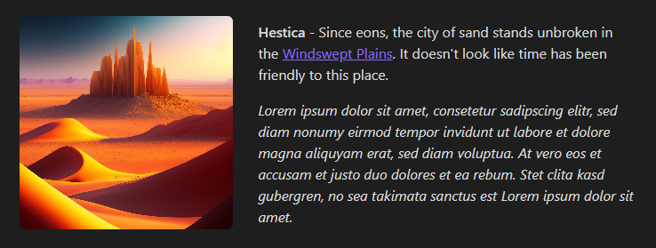
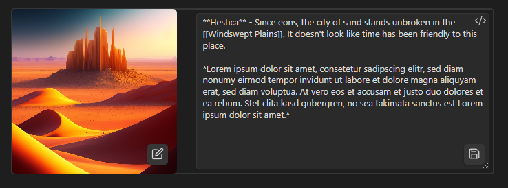

# Obsidian Avatar

This plugin provides you with a component that will display a small image with some accompanying text. That's it.



To use, insert the following snippet into your markdown.

````
```avatar
```
````

## Editing the picture / description

In source mode, you can edit the codeblock directly:

````
```avatar
image: your-image-here.png
description: This will be displayed as the description!
```
````

In live preview mode,

- click on the image to change it (then either select one from your vault, or paste in a URL to a picture online)
- click on the description to edit it (Don't forget to click the button to save your changes!)



The description editor supports all markdown features of Obsidian.
